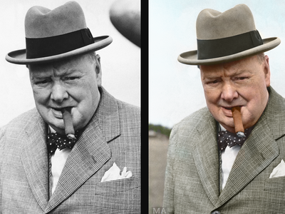

# All colors matter
CS231N project, spring 2018

Vincent Billaut  
Matthieu de Rochemonteix  
Marc Thibault  

## Overview (Project Proposal)

What is the problem that you will be investigating? Why is it interesting?
    What reading will you examine to provide context and background?
    What data will you use? If you are collecting new data, how will you do it?
    What method or algorithm are you proposing? If there are existing implementations, will you use them and how? How do you plan to improve or modify such implementations? You don't have to have an exact answer at this point, but you should have a general sense of how you will approach the problem you are working on.
    How will you evaluate your results? Qualitatively, what kind of results do you expect (e.g. plots or figures)? Quantitatively, what kind of analysis will you use to evaluate and/or compare your results (e.g. what performance metrics or statistical tests)?

[problem]  
Our goal is to tackle the problem of **colorization**, that is taking a gray scale photograph and translating it to its colorized version. This problem is particularly appealing to us, because it involves some kind of generative, creative work which is easily visualizable and even fun.  

 Example taken [here](https://dribbble.com/shots/2122311-Photo-Colorization-Winston-Churchill).

[data]  
 Moreover, finding training data is very straightforward: we will simply consider a big image dataset, such as ImageNet, and for every entry, take the picture itself as the expected output, and its gray-scale version as the input.  

[readings]  
Zhang et al. 2016 propose a deep CNN architecture that aims at solving that problem.  
[method/algorithm, existing implementations, etc.]  
[evaluation: qualitative and quantitative]  
